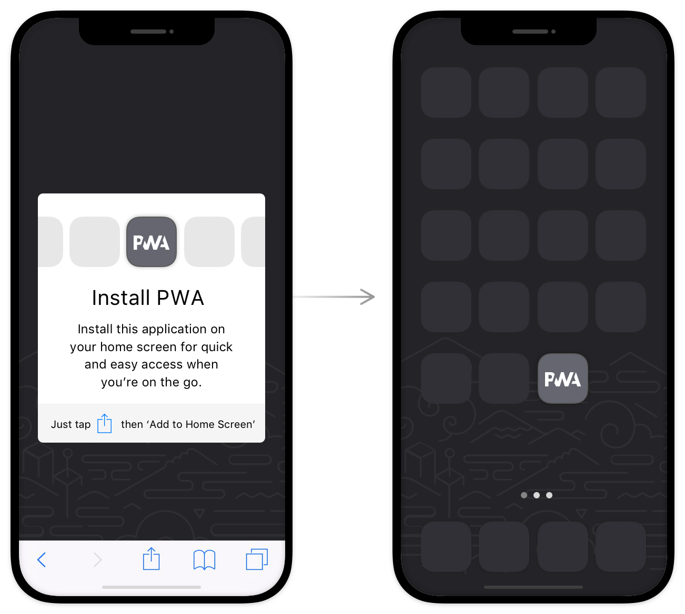

# Standalone




A simple package to force the user to install pwa on mobile or browser.
Basically, this package checks if your website is installed on your device or not.


## Usage/Examples

```javascript
import 'package:flutter/material.dart';
import 'package:standalone/standalone.dart';

class MyApp extends StatelessWidget {
  const MyApp({super.key});

  @override
  Widget build(BuildContext context) {
    return StandaloneBuilder(
      builder: (context, isStandalone, isMobile) {
        return (isStandalone && isMobile) ? const SizedBox() : const SizedBox();
      },
    );
  }
}
```


